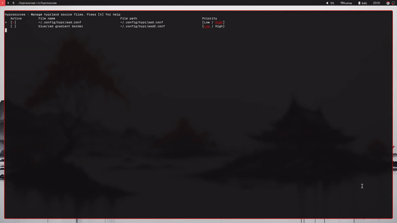

# hyprsources
 hyprsources is a cli tool written in go to manage your hyprland source files.

## Keys
  - `up/down` - Move pointer up and down 
  - `Space` - Select source file as active 
  - `Enter` - Save changes
  - `j/k` - Change the order of the entries 
  - `r` - Rename the source file entry (for identification, works only inside the app)
  - `d` - Delete entry
  - `a` - Add entry

## Known issues
 - The application will not display nor clean the screen correctly when the console is not fullscreened.

## Future plans

  - Templating system for source files, to activate and deactivate relevant files altogether.

## Collaborating

Feel free to end a pull request to fix/add any features